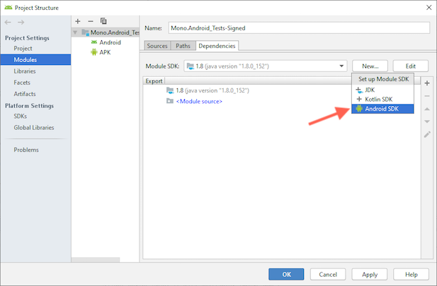

# Development tips

Tips and tricks while developing Xamarin.Android.

## Update directory

When a Xamarin.Android app launches on an Android device, and the app was
built in the `Debug` configuration, it will create an "update" directory
during process startup, printing the created directory to `adb logcat`:

     W/monodroid( 2796): Creating public update directory: `/data/data/Mono.Android_Tests/files/.__override__`

When the app needs to resolve native libraries and assemblies, it will look
for those files within the update directory *first*. This includes the Mono
runtime library and BCL assemblies.

Note that the update directory is *per-app*. The above mentioned `Mono.Android_Tests`
directory is created when running the
[`Mono.Android-Tests.csproj`](../../src/Mono.Android/Test/Mono.Android-Tests.csproj)
unit tests.

The update directory is not used in `Release` configuration builds.
(Note: `Release` configuration for the *app itself*, not for xamarin-android.)

For example, if you're working on a mono/x86 bug and need to quickly update
the app on the device to test `libmonosgen-2.0.so` changes:

    $ make -C src/mono-runtimes/obj/Debug/x86 && \
      adb push src/mono-runtimes/obj/Debug/x86/mono/mini/.libs/libmonosgen-2.0.so \
        /data/data/Mono.Android_Tests/files/.__override__

Alternatively, if you're working on an `mscorlib.dll` bug:

    $ make -C external/mono/mcs/class/corlib PROFILE=monodroid && \
      adb push external/mono/mcs/class/lib/monodroid/mscorlib.dll \
        /data/data/Mono.Android_Tests/files/.__override__

## Update directory on modern physical devices

On modern physical devices, or modern emulators where `adbd` is running in the
default unrooted mode, `adb push` does not have write permissions for the
`/data/data/Mono.Android_Tests/files/.__override__` directory:

    adb: error: stat failed when trying to push to /data/data/Mono.Android_Tests/files/.__override__: Permission denied

To add files to the `.__override__` directory on these devices, first push them
to `/data/local/tmp/`, and then use an `adb run-as` command to copy them to the
application's data directory:

    $ adb push external/mono/mcs/class/lib/monodroid/mscorlib.dll \
        /data/local/tmp/ &&
      adb shell run-as Mono.Android_Tests cp /data/local/tmp/mscorlib.dll \
        /data/data/Mono.Android_Tests/files/.__override__/

This is also how the LLDB debugger launcher in Android Studio and the Android
GDB debugger launcher in Visual Studio [MIEngine][miengine] upload the
`lldb-server` and `gdbserver` executables.  They actually use a slightly
different command for the last step:

    $ adb shell "cat /data/local/tmp/mscorlib.dll | \
        run-as Mono.Android_Tests sh -c \
        'cat > /data/data/Mono.Android_Tests/files/.__override__/mscorlib.dll'"

This `cat` approach might be useful if you discover that the `cp` command does
not have permission to read the `/data/local/tmp/mscorlib.dll` file when you try
it on a particular device.

[miengine]: https://github.com/microsoft/MIEngine/

## Attaching LLDB using Android Studio

 1. Install [Android Studio][android-studio].  If you already have an Android
    SDK installation that you're using with Xamarin.Android, you can click
    **Cancel** on the **Android Studio Setup Wizard** when you launch Android
    Studio.

 2. Open the signed debuggable APK for the application in Android Studio via
    **Profile or debug APK** on the start window or the **File > Profile or
    Debug APK** menu item.

    

 3. If you skipped the **Android Studio Setup Wizard**, navigate to **File >
    Project Structure > Modules > Mono.Android_Tests-Signed > Dependencies**,
    click **New > Android SDK** next to the **Module SDK**.

    

    Select the Android SDK folder you're using with Xamarin.Android, and then
    under **Build target**, pick the appropriate Android API to match the APK,
    click **OK**, and then **OK** again.

 4. If an **Indexing** status message appears at the bottom of the Android
nip   Studio window, wait for it to complete.

 5. Start the app, for example by launching it with or without managed debugging
    from Visual Studio, or by tapping the app on the device.

 6. In Android Studio, select **Run > Attach Debugger to Android Process** (at
    the bottom of the **Run** menu).

    

 7. Set the **Debugger** to **Native**, select the running app, and click
    **OK**.

    If the `adb` connection is slow, the first connection to the app will take a
    while to download all the system libraries.  The connection might time out
    if this takes too long, but the next connection attempt will have fewer
    libraries left to download and will likely succeed.

 8. Depending on the scenario you are debugging, LLDB might break on the signals
    that Mono uses internally.  If it does, you can set LLDB to continue through
    those by opening **View > Tool Windows > Debug**, selecting the **Android
    Native Debugger** tab, and then navigating to the inner **Debugger \[tab\] >
    LLDB \[tab\]** command prompt, and running the following `process handle`
    command:

        (lldb) process handle -p true -n true -s false SIGXCPU SIG33 SIG35 SIGPWR SIGTTIN SIGTTOU SIGSYS

    

[android-studio]: https://developer.android.com/studio/

## Adding debug symbols for the default `libmonosgen-2.0`

 1. Find the Xamarin.Android version you are debugging on
    <https://github.com/xamarin/xamarin-android/tags>, and click that version to
    view the release information.

 2. Click the link for the corresponding open-source build under the **OSS
    core** section of the release information.

 3. Navigate to the **Azure Artifacts** from the left sidebar, and download the
    `xamarin-android/xamarin-android/bin/Release/bundle*.zip` file.

 4. Extract the `libmonosgen-2.0.d.so` files from the bundle.  For example, run:

        $ unzip bundle*.zip '*libmonosgen-2.0.d.so'

 5. Add the appropriate architecture of `libmonosgen-2.0` into LLDB, using a
    command similar to:

        (lldb) target modules add ~/Downloads/lib/xamarin.android/xbuild/Xamarin/Android/lib/armeabi-v7a/libmonosgen-2.0.d.so

 6. Find the current in-memory address of the `.text` section of the shared
    runtime version of `libmonosgen-2.0`.  For example, for a 32-bit app, run
    the following command:

        (lldb) target modules dump sections libmonosgen-32bit-2.0.so

    Look for the row of the table that shows "code" as the "Type":

        SectID     Type             Load Address                             Perm File Off.  File Size  Flags      Section Name
        ---------- ---------------- ---------------------------------------  ---- ---------- ---------- ---------- ----------------------------
        0x0000000d code             [0x00000000a39e4c90-0x00000000a3cb51ec)  r-x  0x0001ec90 0x002d055c 0x00000006 libmonosgen-32bit-2.0.so..text

 7. Now load the full `libmonosgen-2.0.d.so` using the same starting address for
    the `.text` section:

        (lldb) target modules load -f libmonosgen-2.0.d.so .text 0x00000000a39e4c90

## Using a custom `libmonosgen-2.0`

### Option 1: Use the `.__override__` update directory

 1. Push the new `libmonosgen-2.0` into the application's update directory:

        $ adb push libmonosgen-2.0.so \
            /data/local/tmp/ &&
          adb shell run-as Mono.Android_Tests cp /data/local/tmp/libmonosgen-2.0.so \
            /data/data/Mono.Android_Tests/files/.__override__/

 2. In this case, LLDB shows the in-memory address of the whole file instead of
    the individual sections.  For example, run:

        (lldb) target modules dump sections libmonosgen-2.0.so

    And this time, look at just the table header:

        Sections for '/data/data/Mono.Android_Tests/files/.__override__/libmonosgen-2.0.so(0x00000000a39c6000)' (arm):
          SectID     Type             Load Address                             Perm File Off.  File Size  Flags      Section Name
          ---------- ---------------- ---------------------------------------  ---- ---------- ---------- ---------- ----------------------------

 3. Re-load your custom `libmonosgen-2.0` into LLDB.  (It seems LLDB does not
    automatically handle downloading the library and loading the symbols from it
    when the library is located in the `.__override__` directory.)  Note that
    you will need to use a different "dummy" file name for this step to avoid a
    conflict with the module that is already loaded.  So the LLDB command might
    look similar to:

        (lldb) target modules add ~/Desktop/libmonosgen-2.0.so-copy

 4. Now load the `libmonosgen-2.0.so-copy`, this time providing a `-s` "slide"
    option to indicate the whole file offset:

        (lldb) target modules load -f libmonosgen-2.0.d.so -s 0x00000000a39c6000

## Attaching GDB by hand

These steps are generally considered deprecated in favor of LLDB as of
[#1021][pull-1021], but they might be helpful for quick testing if (a) LLDB
shows an unexpected behavior, (b) you already have the Android NDK installed, or
(c) a customer has the Android NDK installed and prefers not to install Android
Studio or the command line LLDB tools.

 1. Add the appropriate architecture of `gdbserver` to the application's data
    directory.  For example, if debugging an arm64-v8a app:

        $ adb push \
            ~/Library/Developer/Xamarin/android-sdk-macosx/ndk-bundle/prebuilt/android-arm64/gdbserver/gdbserver \
            /data/local/tmp/ &&
          adb shell run-as Mono.Android_Tests \
            cp /data/local/tmp/gdbserver /data/data/Mono.Android_Tests/

 2. Ensure all users have execute permissions on the application's data
    directory:

        $ adb shell run-as Mono.Android_Tests \
            chmod a+x /data/data/Mono.Android_Tests/

    This ensures that `adb` will be able to read from a UNIX domain socket
    filename in that directory.

 3. Start the app, for example by launching it with or without managed debugging
    from Visual Studio.

 4. Find the process ID of the running app, for example by using `adb shell ps`:

        $ adb shell ps | grep -F 'Mono.Android_Tests'

    Example output:

        u0_a247   15087 336   780568 69200 SyS_epoll_ 00000000 S Mono.Android_Tests

 5. Start `gdbserver`, attaching it to the running app process:

        $ adb shell run-as Mono.Android_Tests \
            /data/data/Mono.Android_Tests/gdbserver --once \
              +/data/data/Mono.Android_Tests/debug_socket \
              --attach 15087

 6. In another console window, use `adb` to forward the `debug_socket` UNIX
    domain socket to a TCP port on the local host:

        $ adb forward tcp:9999 localfilesystem:/data/data/Mono.Android_Tests/debug_socket

 7. In that new console window, run `gdb`:

        $ ~/Library/Developer/Xamarin/android-sdk-macosx/ndk-bundle/prebuilt/darwin-x86_64/bin/gdb

    And attach to the local host TCP port:

        (gdb) target remote :9999

[pull-1021]: https://github.com/xamarin/xamarin-android/pull/1021

### Comparison to the `<_Gdb/>` MSBuild target

These steps use a Unix domain socket rather than a TCP port to match what the
`ndk-gdb` script from the Android NDK and the Android Studio LLDB connection
steps do.  The advantage of the Unix domain socket is that it works regardless
of whether the app has the `INTERET` permission enabled.  (This isn't too
important for Xamarin.Android apps because Xamarin.Android apps have the
`INTERNET` permission enabled by default in the Debug configuration to enable
the managed debugger connection.)

The old `<_Gdb/>` MSBuild target includes a few refinements beyond these manual
steps.  It pre-downloads the `app_process*` executable and system libraries from
the device to a local `gdb-symbols` directory, and it adds the native libraries
from the shared runtime (if applicable) and the project's APK to that directory.
Then it runs `gdb` commands similar to the following before attaching to the
app:

    set solib-search-path ./gdb-symbols
    file ./gdb-symbol/app_process

At least on modern devices, with the recent versions of `gdb` and `gdbserver`,
`gdb` can take care of these steps automatically after the connection, but
creating the local directory beforehand still saves the time of downloading all
the files.

The `<_Gdb/>` target also a `gdb` command to ignore signals that the Mono
runtime uses internally:

    handle SIGXCPU SIG33 SIG35 SIGPWR SIGTTIN SIGTTOU SIGSYS nostop noprint

The `<_Gdb/>` target still works to set up the `gdb-symbols` directory and the
`gdb-symbols/gdb.env` file, but recent versions of Xamarin.Android no longer pay
attention to the `debug.
